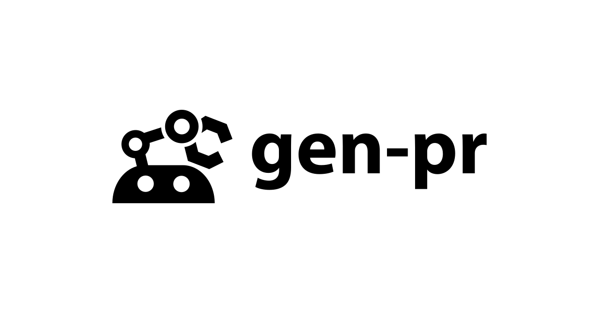

# gen-pr

[](https://github.com/WillBooster/gen-pr/actions/workflows/test.yml)
[](https://github.com/semantic-release/semantic-release)

A CLI and GitHub Action that automatically generate pull requests using AI (specifically, Large Language Models or LLMs).

This tool embodies the ultimate "Vibe Coding" experience, where humans can focus solely on writing issues while AI handles all the implementation details. Our vision is to create a workflow where developers only need to describe what they want, and the AI takes care of translating those requirements into working code.

## Features

- **Planning Capability**: Uses LLM to analyze source code and develop implementation strategies before making any changes
- **Multiple AI Coding Tools**: Supports various coding tools including:
  - [Aider](https://aider.chat/): An interactive AI pair programming tool
  - [Codex CLI](https://github.com/openai/codex): OpenAI's coding agent
  - [Claude Code](https://github.com/anthropics/claude-code): Anthropic's agentic coding tool
- **Flexible Integration**: Works as both a CLI tool and a GitHub Action

## Requirements

- For development:
  - [asdf](https://asdf-vm.com/)
- For execution:
  - Node.js and npx (for `@openai/codex` and `@anthropic-ai/claude-code`)
  - Python (for `aider`)
  - [gh](https://github.com/cli/cli)

## Usage

### GitHub Actions

See [action.yml](action.yml) and [.github/workflows/generate-pr.yml](.github/workflows/generate-pr.yml).

### CLI

Gemini 2.5 Pro (for planning) and Aider (for coding):

```sh
npx --yes gen-pr --issue-number 8 --planning-model gemini/gemini-2.5-pro-preview-06-05 --reasoning-effort high --repomix-extra-args="--compress --remove-empty-lines --include 'src/**/*.ts'" --aider-extra-args="--model gemini/gemini-2.5-pro-preview-06-05 --edit-format diff-fenced --test-cmd='yarn check-for-ai' --auto-test"
```

Claude Opus 4 on Bedrock (for planning) and Aider (for coding):

```sh
npx --yes gen-pr --issue-number 8 --planning-model bedrock/us.anthropic.claude-opus-4-20250514-v1:0 --reasoning-effort high --repomix-extra-args="--compress --remove-empty-lines --include 'src/**/*.ts'" --aider-extra-args="--model bedrock/us.anthropic.claude-opus-4-20250514-v1:0 --test-cmd='yarn check-for-ai' --auto-test"
```

Gemini 2.5 Pro (for planning) and Claude Code (for coding):

```sh
npx --yes gen-pr --issue-number 8 --planning-model gemini/gemini-2.5-pro-preview-06-05 --reasoning-effort high --repomix-extra-args="--compress --remove-empty-lines --include 'src/**/*.ts'" --coding-tool claude-code
```

o4-mini (for planning) and Codex (for coding):

```sh
npx --yes gen-pr --issue-number 8 --planning-model openai/o4-mini --reasoning-effort high --repomix-extra-args="--compress --remove-empty-lines --include 'src/**/*.ts'" --coding-tool codex
```

#### Supported Model Format

The tool requires **model names defined on [llmlite](https://docs.litellm.ai/docs/providers)** in the format `provider/model-name`:

- **OpenAI**: `openai/gpt-4.1`, `openai/o4-mini`
- **Azure OpenAI**: `azure/gpt-4.1`, `azure/o4-mini`
- **Google Gemini**: `gemini/gemini-2.5-pro-preview-06-05`, `gemini/gemini-2.5-flash-preview-05-20`
- **Anthropic**: `anthropic/claude-4-sonnet-latest`, `anthropic/claude-3-5-haiku-latest`
- **AWS Bedrock**: `bedrock/us.anthropic.claude-sonnet-4-20250514-v1:0`, `bedrock/us.anthropic.claude-3-5-haiku-20241022-v1:0`
- **Google Vertex AI**: `vertex/gemini-2.5-pro-preview-06-05`, `vertex/gemini-2.5-flash-preview-05-20`

#### Environment Variables

Each provider uses standard environment variables for authentication:

- **OpenAI**: `OPENAI_API_KEY`
- **Anthropic**: `ANTHROPIC_API_KEY`
- **Google Gemini**: `GOOGLE_GENERATIVE_AI_API_KEY` (or `GEMINI_API_KEY`)
- **Azure OpenAI**: `AZURE_OPENAI_API_KEY`, `AZURE_OPENAI_ENDPOINT`, `AZURE_OPENAI_API_VERSION`
- **AWS Bedrock**: `AWS_ACCESS_KEY_ID`, `AWS_SECRET_ACCESS_KEY`, `AWS_REGION` (or `AWS_REGION_NAME`)
- **Google Vertex AI**: `GOOGLE_APPLICATION_CREDENTIALS` or default service account

## License

Apache License 2.0
